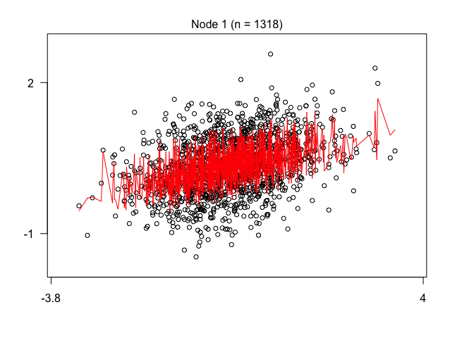

<!-- README.md is generated from README.Rmd. Please edit that file -->

# gardenr

<!-- badges: start -->

[](https://github.com/Chhr1s/gardenr/actions)
[](https://codecov.io/gh/Chhr1s/gardenr)
<!-- badges: end -->

The goal of `{gardenr}` is to provide tools for general linear mixed
effects model regression (GLMM) trees as implemented in the
`{glmertree}` package.

## Installation

You can install the development version of `{gardenr}` from
[GitHub](https://github.com/) with:

``` r
# install.packages("devtools")
devtools::install_github("Chhr1s/gardenr")
```

## Example

Here is an example of using `cross_validate_it()` to help with
hyperparameter tuning.

``` r
library(gardenr)
library(glmertree)
library(tidyverse)
```

## Simulate some data

Here’s a function within the package to simulate some multilevel data.
It has defaults, but these can be changed. use `?sim_multilevel()` for
details.

``` r
dat <- sim_multilevel()
```

## Split Data & Make CV Object

Wherever possible, I wanted to rely on good functions from the
`{tidymodels}` framework. We can use `{rsample}` to spit the data and
make a cross-validation object.

``` r
example_split <- rsample::initial_split(dat)
example_train <- rsample::training(example_split)
example_test  <-  rsample::testing(example_split)
cv <- rsample::vfold_cv(data = example_train, v = 10)
```

## Make a `Formula` object

This is the proposed GLMM tree formula. This is *not* a normal `formula`
object, but a `Formula` object instead. See `?Formula::as.Formula` for
an explanation of the differences.

``` r
ex_formula <-
   Formula::as.Formula(
      'outcome ~ small_1 |
      (1 | id_vector) |
      small_2 + small_c_1 + small_c_2 + nuisance_1a + nuisance_c_1a'
      )
```

## Make a Tuning Grid

We can then use dials to make a tuning grid. Notice that the parameter
objects for GLMM trees have already been made and are in `{gardenr}`
(e.g., `alpha_par()`)

``` r
tuning_grid <-
  dials::grid_max_entropy(
    maxdepth_par(maxdepth_min = 0L, maxdepth_max = 20L),
    alpha_par(alpha_min = 0.10, alpha_max = 0.001),
    trim_par(trim_min = 0.01, trim_max = 0.5),
    size = 10
  )
tuning_grid
#> # A tibble: 10 × 3
#>    maxdepth_par alpha_par trim_par
#>           <int>     <dbl>    <dbl>
#>  1           12   0.0996    0.402 
#>  2           18   0.0548    0.0993
#>  3           13   0.00564   0.0229
#>  4            9   0.0447    0.158 
#>  5           19   0.00537   0.273 
#>  6            9   0.0116    0.453 
#>  7           14   0.0476    0.334 
#>  8            0   0.0664    0.471 
#>  9           11   0.0811    0.0343
#> 10            1   0.0837    0.0433
```

## Fit the Model to the Cross-Validated Data

Here we fit the model to the cross-validated object.

``` r
fitted <-
   cross_validate_it(
      cv_obj = cv,
      seed = 713,
      tuning_grid = tuning_grid,
      mod_formula = ex_formula, 
      cluster = id_vector
      )
#> iteration 1 complete
#> iteration 2 complete
#> iteration 3 complete
#> iteration 4 complete
#> iteration 5 complete
#> iteration 6 complete
#> iteration 7 complete
#> iteration 8 complete
#> iteration 9 complete
#> iteration 10 complete
```

## See Best Fitting Hyperparameters

``` r
best_fit <- 
  fitted %>% 
  dplyr::arrange(rmse) 
best_fit
#> # A tibble: 10 × 6
#>    cv_index maxdepth_par alpha_par trim_par  rmse     mae
#>       <int>        <int>     <dbl>    <dbl> <dbl>   <dbl>
#>  1        7           14   0.0476    0.334  0.436 0.00262
#>  2        3           13   0.00564   0.0229 0.440 0.00267
#>  3        6            9   0.0116    0.453  0.446 0.00275
#>  4       10            1   0.0837    0.0433 0.450 0.00265
#>  5        5           19   0.00537   0.273  0.451 0.00273
#>  6        4            9   0.0447    0.158  0.452 0.00278
#>  7        9           11   0.0811    0.0343 0.462 0.00275
#>  8        8            0   0.0664    0.471  0.470 0.00286
#>  9        1           12   0.0996    0.402  0.484 0.00301
#> 10        2           18   0.0548    0.0993 0.494 0.00304
```

``` r
best_fit_trained <- 
  lmertree(
    data = example_train, 
    formula = 
      ex_formula, 
    maxdepth = best_fit$maxdepth_par[1], 
    alpha = best_fit$alpha_par[1],
    trim = best_fit$trim_par[1], 
    cluster = id_vector,
    verbose = TRUE
  )
#> 'log Lik.' -903.9974 (df=6)
#> 'log Lik.' -885.5143 (df=10)
#> 'log Lik.' -885.5143 (df=10)
```

## See the Default Plot

``` r
plot(best_fit_trained$tree)
```



## Get RMSE for unseen data

``` r
example_test %>% 
  mutate(
    predictions =
      predict(
        best_fit_trained, 
        newdata = example_test, 
        allow.new.levels = TRUE
        )
    ) %>% 
  summarize(
    rmse_unseen = 
      rmse(observed_y = outcome, predicted_y = predictions)
    )
#>   rmse_unseen
#> 1   0.4435808
```

## Plot the Parameters in One Space

This can clarify what the difference is

``` r
summary(best_fit_trained$tree) %>%
  purrr::map_dfr(broom::tidy, .id = 'node') %>% 
  dplyr::mutate(node = factor(node)) %>% 
  ggplot(
    aes(
      x = term, 
      y = estimate, 
      color = node,
      ymin = estimate - 1.96*std.error, 
      ymax = estimate + 1.96*std.error
      )
    ) + 
  geom_pointrange(position = position_dodge(width = 0.5)) +
  theme_bw()
```


